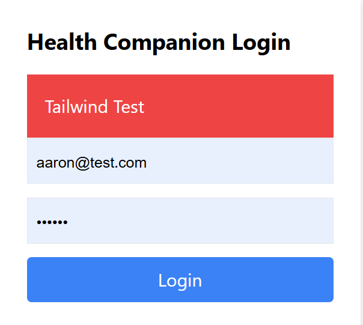

# 🩺 MediChat - AI Health Companion

A full-stack AI-powered health assistant that provides:

* 💬 Conversational health support (Chatbot)
* 🧠 Symptom-based analysis
* 📊 Health metrics tracking

Built using **React, Node.js, Express, Prisma, PostgreSQL, and Gemini API**

---

## 🚀 Features

* 🤖 AI Chatbot using Gemini API
* 🩺 Symptom Checker with severity detection
* 🗂 Chat history stored in PostgreSQL (via Prisma)
* 🔐 Authentication-ready structure
* 🎨 Clean UI with Tailwind CSS

---

## 📸 Screenshots

### Chatbot


### Symptom Checker


### Login Page



---

## 🛠 Tech Stack

**Frontend**

* React + TypeScript
* Tailwind CSS
* Axios

**Backend**

* Node.js + Express
* Prisma ORM
* PostgreSQL
* Gemini API

---

## ⚙️ Setup Instructions

### 1. Clone the repo

```bash
git clone https://github.com/officialaarondsouza-art/MediChat-Health-companion.git
cd MediChat-Health-companion
```

### 2. Backend setup

```bash
cd backend
npm install
```

Create `.env` file:

```
DATABASE_URL=your_postgres_url
GEMINI_API_KEY=your_api_key
PORT=5000
```

Run:

```bash
npm run dev
```

---

### 3. Frontend setup

```bash
cd ../health-companion-frontend
npm install
npm run dev
```

---

## 📌 Future Improvements

* 🔐 JWT Authentication
* 📱 Mobile responsiveness improvements
* 🧾 Medical report generation
* 🧠 Better AI prompt structuring

---

## ⚠️ Disclaimer

This is **not a medical diagnosis tool**. Always consult a professional doctor.

---

## 👨‍💻 Author

Aaron D'Souza
3rd Year ELCS Student @ Christ University
